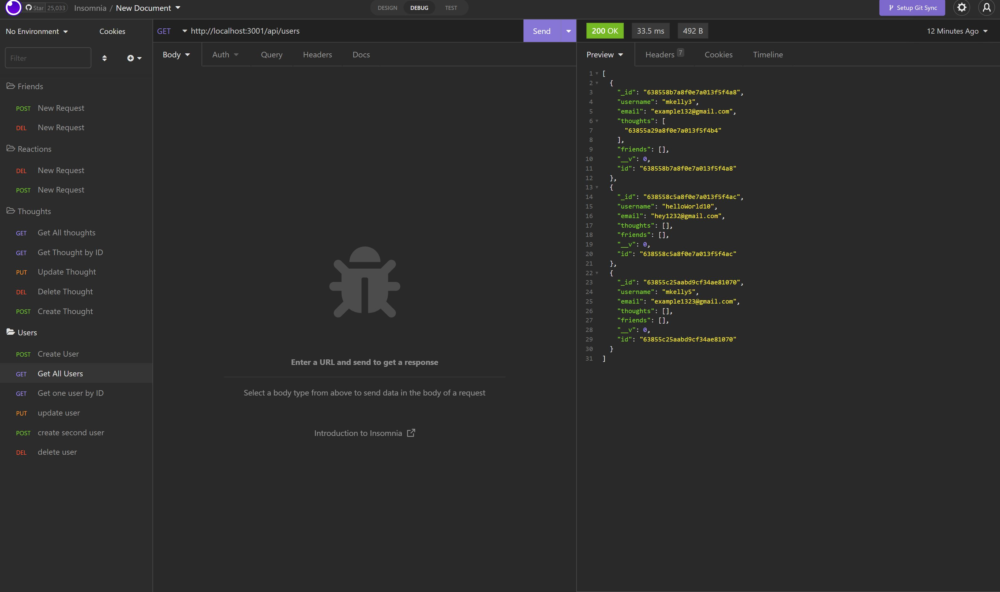

# Social Network API

## Table of Contents
- [Description](#description)
- [Code Snippet](#code-snippet)
- [Technologies Used](#technologies-used)
- [Installation](#instalation)
- [Contact Information](#contact-information)

## Description
An API for users to share their thoughts, reactions with friends. All GET, POST, PUT and DELETE routes for thoughts and users tested in insomnia. 



## Code Snippet
To find one user by ID the mongoose findOne() method was used. 

```
getUsersById(req,res){
        Users.findOne({ _id: req.params.id })
        .then((user) =>
          !user
            ? res.status(404).json({ message: 'No user with that ID' })
            : res.json(user)
        )
        .catch((err) => res.status(500).json(err));
    },
```

## Technologies Used
- Mongoose
- Express.js

## Instalation
- Mongoose
- nodemon

## Contact Information 
- [GitHub](https://github.com/mkelly3/)
- [Linkedin](https://www.linkedin.com/in/morgan-kelly15/)